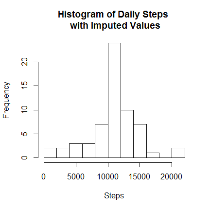

# PA1_template
treepruner  
November 2, 2015  

rm(list = ls())


#### Overview

This assignment makes use of data from a personal activity monitoring device. This device collects data at 5 minute intervals through out the day. The data consists of two months of data from an anonymous individual collected during the months of October and November, 2012 and include the number of steps taken in 5 minute intervals each day.


The variables included in this dataset are:

 * steps: Number of steps taking in a 5-minute interval (missing values are coded as NA)

 * date: The date on which the measurement was taken in YYYY-MM-DD format

 * interval: Identifier for the 5-minute interval in which measurement was taken

The dataset is stored in a comma-separated-value (CSV) file and there are a total of 17,568 observations in this dataset.


#### Get Data


```r
fileURL <- "https://d396qusza40orc.cloudfront.net/repdata%2Fdata%2Factivity.zip"
download.file(fileURL, "./proj1/repdata%2Fdata%2Factivity.zip", method = "curl")
```

```
## Warning: running command 'curl "https://d396qusza40orc.cloudfront.net/
## repdata%2Fdata%2Factivity.zip" -o "./proj1/repdata%2Fdata%2Factivity.zip"'
## had status 127
```

```
## Warning in download.file(fileURL, "./proj1/repdata%2Fdata
## %2Factivity.zip", : download had nonzero exit status
```

```r
unzip(zipfile = "repdata%2Fdata%2Factivity.zip")
```

```
## Warning in unzip(zipfile = "repdata%2Fdata%2Factivity.zip"): error 1 in
## extracting from zip file
```

```r
dir()
```

```
## [1] "letters"                    "PA1_template.html"         
## [3] "PA1_template.Rmd"           "PA2_template.Rmd"          
## [5] "proj1"                      "README.md"                 
## [7] "ReproducibleResearch.Rproj" "RR_Quiz1.R"                
## [9] "RR_Quiz2.R"
```

```r
activity <- read.csv("./proj1/activity.csv")
```

#### Exploratory Analyses

Display the size of the data frame and some sample records that aren't NA.

 * look at summaries
 * check for missing data
 * create exploratory plots
 * perform exploratory analyses 


```r
activity_rowCnt <-nrow(activity)
str(activity)
```

```
## 'data.frame':	17568 obs. of  3 variables:
##  $ steps   : int  NA NA NA NA NA NA NA NA NA NA ...
##  $ date    : Factor w/ 61 levels "2012-10-01","2012-10-02",..: 1 1 1 1 1 1 1 1 1 1 ...
##  $ interval: int  0 5 10 15 20 25 30 35 40 45 ...
```

```r
head(activity, n = 5)
```

```
##   steps       date interval
## 1    NA 2012-10-01        0
## 2    NA 2012-10-01        5
## 3    NA 2012-10-01       10
## 4    NA 2012-10-01       15
## 5    NA 2012-10-01       20
```

```r
tail(activity, n = 5)
```

```
##       steps       date interval
## 17564    NA 2012-11-30     2335
## 17565    NA 2012-11-30     2340
## 17566    NA 2012-11-30     2345
## 17567    NA 2012-11-30     2350
## 17568    NA 2012-11-30     2355
```

```r
activity[5000:5005,]
```

```
##      steps       date interval
## 5000   757 2012-10-18      835
## 5001   608 2012-10-18      840
## 5002   568 2012-10-18      845
## 5003   571 2012-10-18      850
## 5004   355 2012-10-18      855
## 5005    55 2012-10-18      900
```

```r
summary(activity)
```

```
##      steps                date          interval     
##  Min.   :  0.00   2012-10-01:  288   Min.   :   0.0  
##  1st Qu.:  0.00   2012-10-02:  288   1st Qu.: 588.8  
##  Median :  0.00   2012-10-03:  288   Median :1177.5  
##  Mean   : 37.38   2012-10-04:  288   Mean   :1177.5  
##  3rd Qu.: 12.00   2012-10-05:  288   3rd Qu.:1766.2  
##  Max.   :806.00   2012-10-06:  288   Max.   :2355.0  
##  NA's   :2304     (Other)   :15840
```


```r
plot(activity$date, activity$steps)
```

 


#### Clean and Preprocess Data

The date is currently a factor and needs to be converted to a date.Use dplyr and mosaic packages to create a new factor variable to indicate weekend or weekday.


```r
activity$modDate <- as.Date(activity$date)

weekend <-c("Saturday", "Sunday")

activity <- mutate(activity,
  dayType = derivedFactor(
 "weekend" = (weekdays(activity$modDate) %in% weekend),
 .method = "first",
 .default = "weekday"
))
```


Retain only the completed cases in a new data frame to resolve the NA issue. 


```r
cc <-activity[complete.cases(activity),]
cc_rowCnt <- nrow(cc)
incomplete <- activity_rowCnt - cc_rowCnt
```


#### What is mean total number of steps taken per day for complete cases?

dplyr is the most understandable and easiest way to do this:


```r
stepsByDate <- 
        cc %>% 
        group_by(modDate) %>% 
        summarise(n_date = n(), sum_dateSteps = sum(steps) , mean_dateSteps = mean(steps))
```


#### Histogram of Complete Case Steps by Date


```r
hist(stepsByDate$sum_dateSteps,
     xlab = "Steps",
     breaks = 10,
     main = "Histogram of Complete Cases Daily Steps"
     )
```

 


```r
datasetMean <- mean(stepsByDate$sum_dateSteps)
datasetMedian <- median(stepsByDate$sum_dateSteps)
```

The mean of the total number of steps for complete cases taken per day is 10766.19.

The median of the total number of steps for complete cases taken per day is 10765.

### What is the average daily activity pattern for complete cases?

Use dplyr to create summaries by 5 minute interval:


```r
stepsByInterval <- 
        cc %>% 
        group_by(interval) %>% 
        summarise(n_interval = n(), sum_intervalSteps = sum(steps) , mean_intervalSteps = mean(steps))
```


#### Times Series Plot

Which 5-minute interval, on average across all the days in the dataset, contains the maximum number of steps?


```r
stepsByInterval[which(stepsByInterval$mean_intervalSteps == max(stepsByInterval$mean_intervalSteps)),]
```

```
## Source: local data frame [1 x 4]
## 
##   interval n_interval sum_intervalSteps mean_intervalSteps
## 1      835         53             10927           206.1698
```

```r
maxInterval <- stepsByInterval[which(stepsByInterval$mean_intervalSteps == max(stepsByInterval$mean_intervalSteps)),1]
```


```r
plot(stepsByInterval$interval, stepsByInterval$mean_intervalSteps,
    type = "l",
    ylab = "Mean Steps",
    xlab = "Interval")
    abline(v = maxInterval, col = "red")
```

 


### Impute Missing Values

The original dataset had 17568 rows. 
The data set after removing the incomplete cases had 15264 rows.

This is a difference of 'r incomplete` records

The NA records in the original data set have been defaulted to use the mean for the particular 5 minute interval and saved as the data frame activityImputed. The package sqldf was used to join to the interval summary dataframe.


```r
activityImputed1 <- sqldf( 
        "select a.*, i.mean_intervalSteps, i.sum_intervalSteps    
        from activity a join stepsByInterval i on a.interval = i.interval")
```

```
## Loading required package: tcltk
```

```r
activityImputed2 <- sqldf(c("update activityImputed1 set steps = mean_intervalSteps where steps  is null", "select * from main.activityImputed1"))

summary(activityImputed2)
```

```
##      steps                date          interval         modDate          
##  Min.   :  0.00   2012-10-01:  288   Min.   :   0.0   Min.   :2012-10-01  
##  1st Qu.:  0.00   2012-10-02:  288   1st Qu.: 588.8   1st Qu.:2012-10-16  
##  Median :  0.00   2012-10-03:  288   Median :1177.5   Median :2012-10-31  
##  Mean   : 37.33   2012-10-04:  288   Mean   :1177.5   Mean   :2012-10-31  
##  3rd Qu.: 27.00   2012-10-05:  288   3rd Qu.:1766.2   3rd Qu.:2012-11-15  
##  Max.   :806.00   2012-10-06:  288   Max.   :2355.0   Max.   :2012-11-30  
##                   (Other)   :15840                                        
##     dayType      mean_intervalSteps sum_intervalSteps
##  weekend: 4608   Min.   :  0.000    Min.   :    0.0  
##  weekday:12960   1st Qu.:  2.486    1st Qu.:  131.8  
##                  Median : 34.113    Median : 1808.0  
##                  Mean   : 37.383    Mean   : 1981.3  
##                  3rd Qu.: 52.835    3rd Qu.: 2800.2  
##                  Max.   :206.170    Max.   :10927.0  
## 
```


#### Summarize the Imputed File


```r
imputedStepsByDate <- 
        activityImputed2 %>% 
        group_by(modDate) %>% 
        summarise(n_date = n(), sum_dateSteps = sum(steps) , mean_dateSteps = mean(steps))
```


Make a histogram of the steps by day including the imputed values


```r
hist(imputedStepsByDate$sum_dateSteps,
     xlab = "Steps",
     breaks = 10,
     main = "Histogram of Daily Steps with Imputed Values"
     )
```

 


```r
imputedDatasetMean <- mean(imputedStepsByDate$sum_dateSteps)
imputedDatasetMedian <- median(imputedStepsByDate$sum_dateSteps)

mean_diff <- datasetMean - imputedDatasetMean
median_diff <- datasetMedian - imputedDatasetMedian
```

The mean of the total number of steps   taken per day is 10749.77 after imputation.

The median of the total number of steps  taken per day is 10641 after imputation.

The mean changed by 16.41819

The median changed by 124


### Are there differences in activity patterns between weekdays and weekends?


Make a panel plot containing a time series plot (i.e. type = "l") of the 5-minute interval (x-axis) and the average number of steps taken, averaged across all weekday days or weekend days (y-axis). See the README file in the GitHub repository to see an example of what this plot should look like using simulated data.


```r
imputedStepsByDayType <- 
        activityImputed2 %>% 
        group_by(dayType) %>% 
        summarise(n_date = n(), sum_dayTypeSteps = sum(steps) , mean_dayTypeSteps = mean(steps))
```


#### Panel Plot of Avg Steps Taken 


```r
xyplot(imputedStepsByDayType$interval ~  imputedStepsByDayType$mean_intervalSteps | imputedStepsByDayType$dayType,
    type = "l",
    ylab = "Mean Steps",
    xlab = "Interval")
```

```
## Warning in order(as.numeric(x)): NAs introduced by coercion
```

```
## Warning in diff(as.numeric(x[ord])): NAs introduced by coercion
```

```
## Warning in diff(as.numeric(y[ord])): NAs introduced by coercion
```

```
## Warning in (function (x, y, type = "p", groups = NULL, pch = if
## (is.null(groups)) plot.symbol$pch else superpose.symbol$pch, : NAs
## introduced by coercion
```

```
## Warning in (function (x, y, type = "p", groups = NULL, pch = if
## (is.null(groups)) plot.symbol$pch else superpose.symbol$pch, : NAs
## introduced by coercion
```

 

